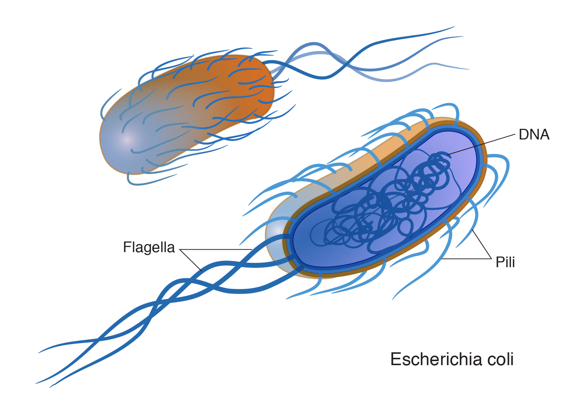

```{r setup, include=FALSE}
knitr::opts_chunk$set(echo = TRUE)
```

Continuing from the Download.R script, we will load the Sequence.csv file.
```{r}
dat <- read.csv('./Sequences.csv')
```

Next, we will count the number of each base pair.

```{r}
library(stringr)
(a <- str_count(dat$Sequence, 'A'))
(t <- str_count(dat$Sequence, 'T'))
(g <- str_count(dat$Sequence, 'G'))
(c <- str_count(dat$Sequence, 'C'))
```

Sequence | Number of A | Number of T | Number of G | Number of C
---------|-------------|-------------|-------------|------------
1        |154          |114          |131          |82
         |             |             |             |
2        |155          |114          |131          |81
         |             |             |             |
3        |154          |115          |131          |81

Below, we can visualize each sequence.
```{r}
print(dat$Sequence)
```

This is what a bacterium looks like  

You can learn more about bacteria from this [link.](https://en.wikipedia.org/wiki/Borrelia_burgdorferi)

```{r}
nchar(dat$Sequence)
(GC1 <- ((131+82)/481)*100)
(GC2 <- ((131+81)/481)*100)
(GC3 <- ((131+82)/481)*100)
```

Sequence ID | GC Content
------------|-----------
HQ433692.1  |44.28%
HQ433694.1  |44.07%
HQ433691.1  |44.28%
